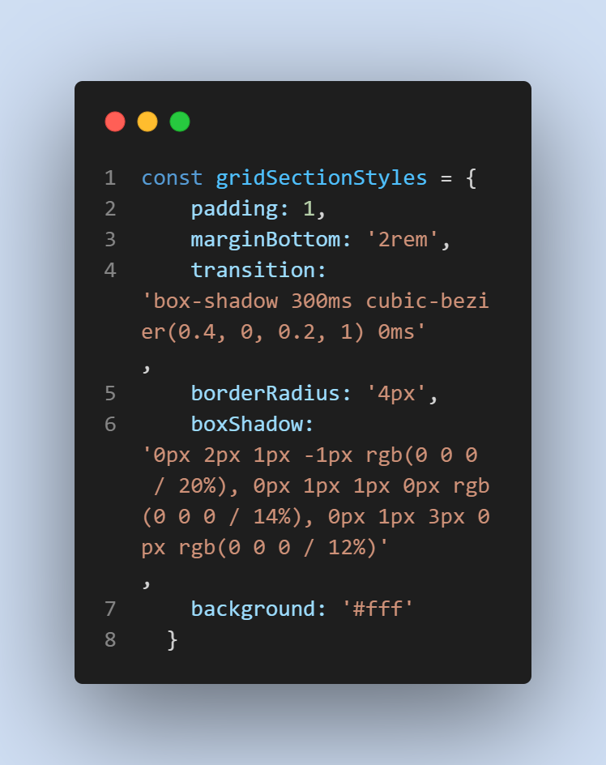
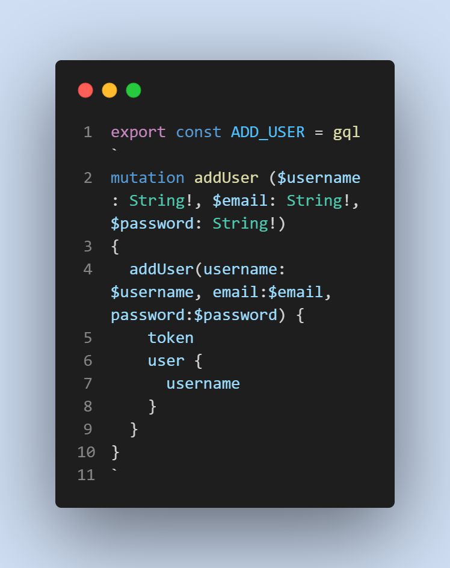
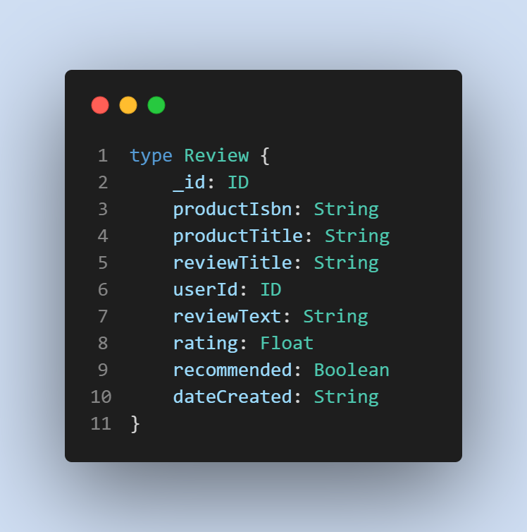
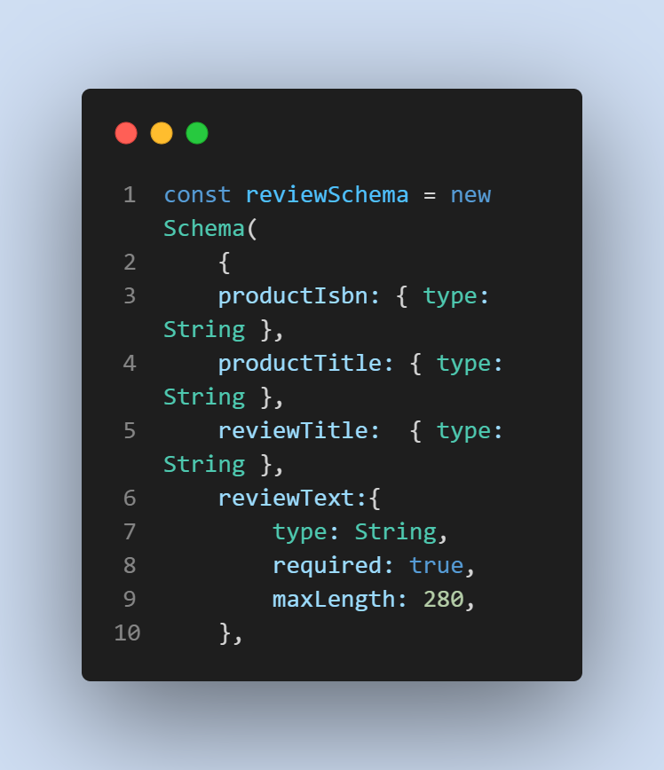

# Quick Reviews 
<div align="center">
 
  
  
   
 
 
 
 
 
</div>


### Heroku Deployment
[Deployed to Heroku](https://quick-reviews.herokuapp.com/)


## Description

A platform where you can replicate the experience of inviting your friends to your private library, share your favorite books and describe your thoughts
Our motivations include are to replicate successful websites such as GoodReads so that we can aspire ourselves to create new platforms that solve problems and connect people.

# Table of contents
1. [Technologies used](#techologies-used)
2. [Usage](#usage)
3. [Credits](#credits)
4. [License](#license)

## Technologies used
* Javascript
* Mongoose
* Express
* Node
* Heroku
* HTML 5
* CSS
* REACT.JS
* JSON WEB token
* Apollo server expressJs
* JWT decode
* Apollo client
* Material UI


## Usage

 * To run locally: Run develop command in a new terminal. Note: command uses nodemon.
    - ```
        npm run develop
        ``` 


### Screenshots
#### Front End:

* Styles using Material UI


* The ADD_USER mutation includes username, email and password. 

#### Back End: 

* The type def for review includes Rating as a Float value and recommended as a Boolean.


* Review text will have no more than 280 characters.


## Credits

* [Alan Anibal](https://github.com/alananibal)
* [Eric Ng](https://github.com/EricNg314)
* [Libin Wang](https://github.com/ten-gou)
* [Travis Nichols](https://github.com/travnichols916/)


## License
[MIT License](https://choosealicense.com/licenses/mit/)

